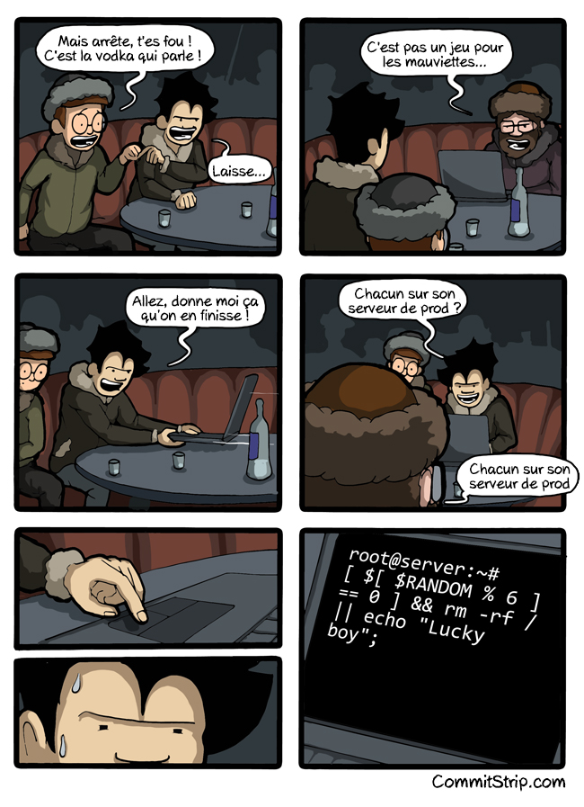

# ISS - Initiation aux Systèmes d’exploitation et au Shell
## TP 03 – Redirection et variables d’environnement [](mailto:zhenyue.fu@etu.sorbonne-universite.fr)

### Exercice 1 : Un classique
- Q1
```bash
wget http://julien.sopena.fr/LU2IN020-TP_03.tgz
tar xzf LU2IN020-TP_03.tgz 
```
- Q2
Ce programme modifie les lettres minuscules dans chaîne de caractères. La i-ième lettre de l'alphabet devient i + n. n est le paramètre entier du programme.
- Q3
```ba
28620112@ssh:~/LU2IN020/tp_03/exo1$ gcc cesar.c -o cesar
28620112@ssh:~/LU2IN020/tp_03/exo1$ ./cesar 12
sdfre2
eprdq2
aa
mm
1234
1234
```
- Q4
```sh
#!/bin/bash
for num in $(seq 1 26); do
    echo -n $num:
    ./cesar $num <fenetre_sur_coquillage/part1
done
```
Les résultats sont les suivants:
```
28620112@ssh:~/LU2IN020/tp_03/exo1$ sh find_key.sh 
1:Lp Blds n'pde xêxp dzfd Wtyozhd !!!
2:Lq Bmet o'qef yêyq eage Wuzpaie !!!
3:Lr Bnfu p'rfg zêzr fbhf Wvaqbjf !!!
4:Ls Bogv q'sgh aêas gcig Wwbrckg !!!
5:Lt Bphw r'thi bêbt hdjh Wxcsdlh !!!
6:Lu Bqix s'uij cêcu ieki Wydtemi !!!
7:Lv Brjy t'vjk dêdv jflj Wzeufnj !!!
8:Lw Bskz u'wkl eêew kgmk Wafvgok !!!
9:Lx Btla v'xlm fêfx lhnl Wbgwhpl !!!
10:Ly Bumb w'ymn gêgy miom Wchxiqm !!!
11:Lz Bvnc x'zno hêhz njpn Wdiyjrn !!!
12:La Bwod y'aop iêia okqo Wejzkso !!!
13:Lb Bxpe z'bpq jêjb plrp Wfkaltp !!!
14:Lc Byqf a'cqr kêkc qmsq Wglbmuq !!!
15:Ld Bzrg b'drs lêld rntr Whmcnvr !!!
16:Le Bash c'est même sous Windows !!!
17:Lf Bbti d'ftu nênf tpvt Wjoepxt !!!
18:Lg Bcuj e'guv oêog uqwu Wkpfqyu !!!
19:Lh Bdvk f'hvw pêph vrxv Wlqgrzv !!!
20:Li Bewl g'iwx qêqi wsyw Wmrhsaw !!!
21:Lj Bfxm h'jxy rêrj xtzx Wnsitbx !!!
22:Lk Bgyn i'kyz sêsk yuay Wotjucy !!!
23:Ll Bhzo j'lza têtl zvbz Wpukvdz !!!
24:Lm Biap k'mab uêum awca Wqvlwea !!!
25:Ln Bjbq l'nbc vêvn bxdb Wrwmxfb !!!
26:Lo Bkcr m'ocd wêwo cyec Wsxnygc !!!
```
On a trouvé que 16 est la clé que nous recherchons.
- Q5
```sh
#!/bin/bash
cd fenetre_sur_coquillage
for filename in $(ls); do
    ../cesar 16 <$filename >>../news.txt
done
```
On a le fichier `news.txt`.
>Le Bash c'est même sous Windows !!!
Grâce à Windows Subsystem for Linux (wsl),
il est aujourd'hui possible d'exécuter des
exécutables binaires Linux (au format ELF)
de manière native sur Windows 10. On peut
voir ce mécanisme comme une émulation du 
"mode user" d'un système gnu-Linux. Une fois
activé, on a accès à plusieurs distributions
intégrant Bash.

### Exercice 2 : SplitStrip
- Q1
```bash
#!/bin/bash
save_dir="chunks"
if [ ! -d "$save_dir" ]; then
    mkdir $save_dir
fi
cd $save_dir
for i in {00..99}; do
    if
        [ ! -f "data.$i" ]
    then
        wget http://julien.sopena.fr/chunks/data.$i
    fi
done
```
- Q2
```bash
cd chunks
cat data.* > d
```
On a obtenu les fichiers `d` après avoir fusionné tous les chunks.
- Q3
```
28620112@ssh:/users/nfs/Etu2/28620112/LU2IN020/tp_03/exo2/chunks$ file d
d: JPEG image data, Exif standard: [TIFF image data, little-endian, direntries=0], baseline, precision 8, 650x897, frames 3
```
J'ai renommé le fichier avec la commande suivante
```bash
mv d pic.jpg
```
On a fini par avoir une photo `pic.jpg`


### Exercice 3
- Q1
```bash
wc -c < test
```
- Q2
```bash
#!/bin/bash
if [ $# != 1 ]; then
    echo "Il manque un paramètre"
    echo "Usage : ./$0 <dir_name>"
    exit 1
fi
if [ ! -d "$1" ]; then
    echo "err:dir not found"
    exit 1
fi
max=0
lenth=0
max_name=""
cd $1
for file_name in $(ls); do
    lenth=$(wc -c <$file_name)
    if [ $(($max)) -le $(($lenth)) ]; then
        max=$lenth
        max_name=$file_name
    fi
done
echo $max_name
```
- Q3
```bash
#!/bin/bash
if [ ! -d "sélection" ]; then
    mkdir sélection
fi
cd dico
for i in $(seq 4); do
    mv $(bash ../biggest.sh ../dico) ../sélection
done
```
- Q4
```
28620112@ssh:/users/nfs/Etu2/28620112/LU2IN020/tp_03/exo3$ bash select.sh 
28620112@ssh:/users/nfs/Etu2/28620112/LU2IN020/tp_03/exo3$ cd sélection
28620112@ssh:/users/nfs/Etu2/28620112/LU2IN020/tp_03/exo3/sélection$ ls
bien  parti  pour  valider
```